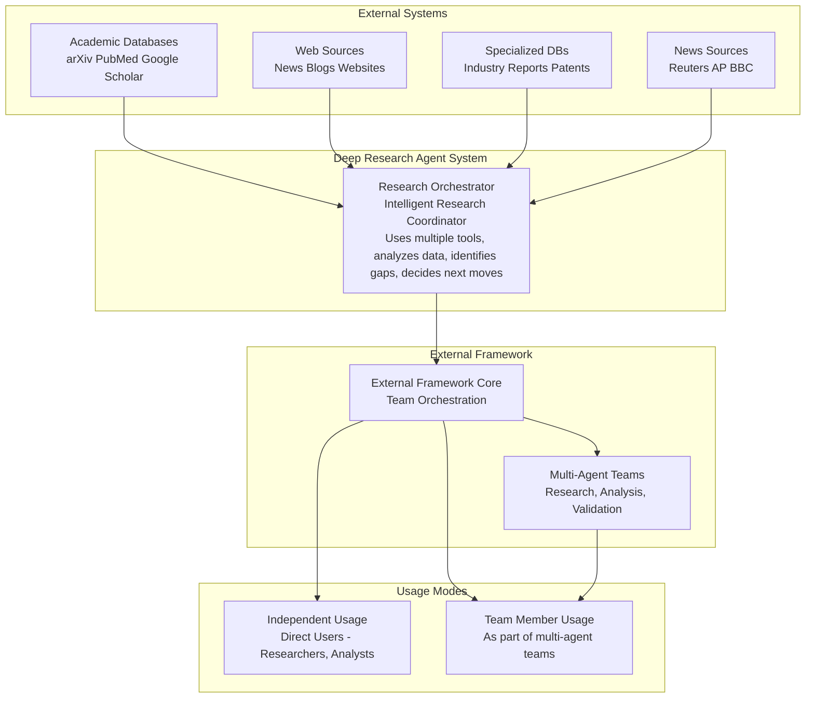
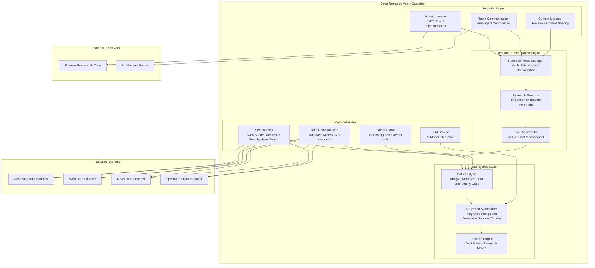
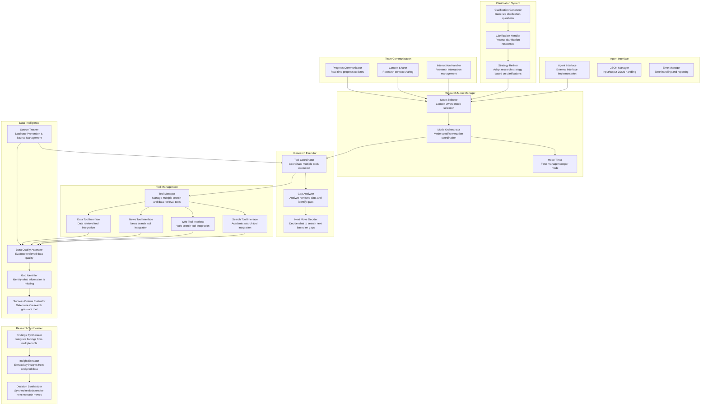
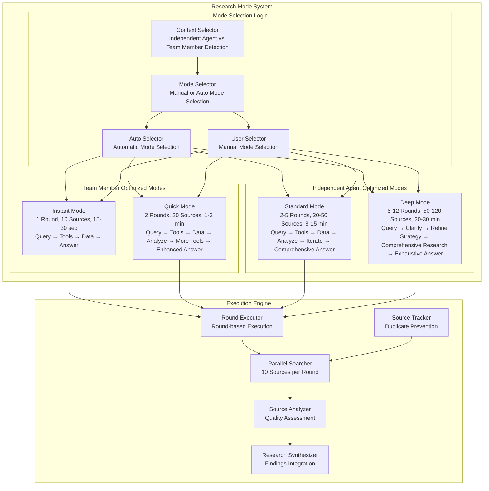
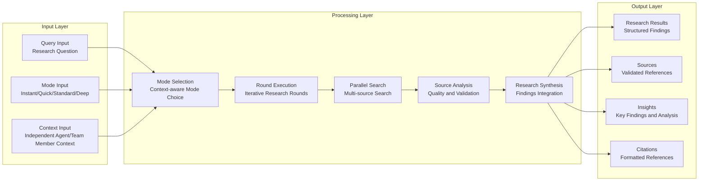
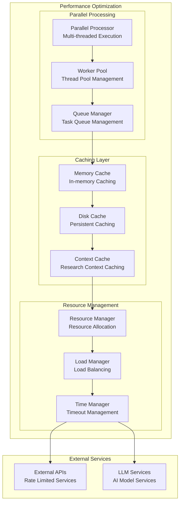
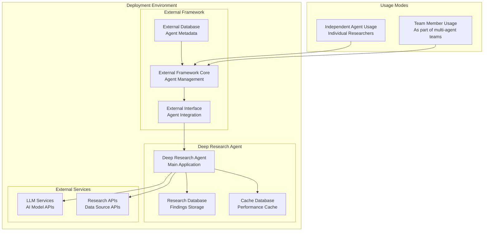

# Deep Research Agent - Architecture Design (Fixed Diagrams)

**Document Type**: Architecture Design  
**Author**: William  
**Date Created**: 2025-09-26  
**Last Updated**: 2025-09-26  
**Status**: Draft  
**Stakeholders**: Research community, Academic institutions, Corporate R&D teams, AgentHub framework users  
**Architecture Version**: 1.0  

## Architecture Reference
**Requirement Analysis**: [Link to requirement analysis in `.requirement_analysis/` folder]  
**Requirement Version**: 1.0 (2025-09-26)

## Problem Definition
**Problem**: Researchers need an intelligent research orchestrator that can use multiple tools (search, data retrieval), understand requests, analyze retrieved data, identify gaps, determine success criteria, and decide next research moves.

**Current State**: Fragmented research tools with no unified interface, manual research workflows, limited multi-agent integration capabilities.

**Target State**: An intelligent research orchestrator that uses multiple tools, analyzes retrieved data, identifies research gaps, determines success criteria, and makes intelligent decisions about next research moves, with four optimized modes for different research depths. Supports both auto mode selection and manual mode selection, with configurable external tools.

**Usage Examples (via AgentHub)**:
```python
# Specific research modes with external tools
import agenthub as ah
agent = ah.load_agent("agentplug/research-agent", external_tools=["web_search", "document_retrieval"])
result = agent.deep_research("Give me a report about newest policy of the US about the H1B visa")

# Auto mode selection
result = agent.solve("Give me a report about newest policy of the US about the H1B visa")
```

**Repository**: This agent will be implemented in `agentplug/research-agent` and published to AgentHub marketplace.

**Architecture Pattern**: Object-Oriented design with BaseAgent and ResearchAgent inheritance:
- **BaseAgent**: Common agent capabilities shared across all agents
- **ResearchAgent**: Inherits from BaseAgent, specialized for research functionality

**Impact**: Transform research workflows from weeks of manual work to minutes of AI-powered comprehensive research.

## System Context (C4 Level 1)



## Container Diagram (C4 Level 2)



## Component Diagram (C4 Level 3)



## Research Mode Architecture



## Research Algorithm Architecture

### Core Research Algorithm

The research agent implements a progressive enhancement algorithm that adapts complexity based on the selected mode:

**Algorithm Overview**:
1. **Query Understanding**: Parse and analyze the research question
2. **Tool Selection**: Choose appropriate tools based on query type
3. **Source Tracking**: Maintain registry of used sources to prevent duplicates
4. **Progressive Enhancement**: Apply mode-specific research strategies
5. **Result Synthesis**: Generate comprehensive answers from retrieved data

### Mode-Specific Workflows

#### Instant Research Workflow
- **Process**: Query → Tools → Data → Answer
- **Rounds**: 1
- **Sources**: 10
- **Time**: 15-30 seconds
- **Strategy**: Direct tool execution with immediate answer generation
- **Use Case**: Quick information retrieval for multi-agent systems

#### Quick Research Workflow
- **Process**: Query → Tools → Data → Analyze → More Tools → Enhanced Answer
- **Rounds**: 2
- **Sources**: 20
- **Time**: 1-2 minutes
- **Strategy**: Context-aware improvement through analysis and follow-up searches
- **Use Case**: Team coordination with enhanced accuracy

#### Standard Research Workflow
- **Process**: Query → Tools → Data → Analyze → Iterate → Comprehensive Answer
- **Rounds**: 2-5
- **Sources**: 20-50
- **Time**: 8-15 minutes
- **Strategy**: Iterative improvement through multiple rounds of analysis
- **Use Case**: Comprehensive research for direct users

#### Deep Research Workflow
- **Process**: Query → Clarify → Refine Strategy → Comprehensive Research → Exhaustive Answer
- **Rounds**: 5-12
- **Sources**: 50-120
- **Time**: 20-30 minutes
- **Strategy**: Clarification-driven research with refined strategy
- **Use Case**: Exhaustive research with user/agent clarification

### Source Tracking Mechanism

**Duplicate Prevention Strategy**:
- **Source Registry**: Maintain unique identifiers for all accessed sources
- **Content Hashing**: Generate content-based hashes to detect duplicates
- **Domain Tracking**: Track sources by domain and URL patterns
- **Query Association**: Associate sources with specific search queries
- **Availability Checking**: Verify source availability before reuse

**Source Selection Algorithm**:
- **Availability Filter**: Filter out previously used sources
- **Relevance Scoring**: Score remaining sources by relevance to current query
- **Diversity Optimization**: Ensure source diversity across domains and types
- **Quality Thresholding**: Apply minimum quality thresholds for source selection

### Context-Aware Enhancement

**Analysis Components**:
- **Gap Identification**: Identify missing information in current results
- **Contradiction Detection**: Detect conflicting information across sources
- **Coverage Assessment**: Evaluate completeness of information coverage
- **Quality Evaluation**: Assess reliability and credibility of sources

**Enhancement Strategies**:
- **Follow-up Queries**: Generate targeted queries based on identified gaps
- **Source Diversification**: Expand search to different source types
- **Depth Progression**: Increase search depth for complex topics
- **Validation Searches**: Cross-reference information across multiple sources

### Clarification System (Deep Mode)

**Clarification Generation**:
- **Scope Clarification**: Identify ambiguous scope requirements
- **Depth Clarification**: Determine required detail level
- **Domain Clarification**: Specify relevant domains or fields
- **Timeline Clarification**: Define temporal requirements
- **Perspective Clarification**: Specify viewpoint or context

**Multi-Agent Integration**:
- **Managing Agent Communication**: Request clarifications from managing agent
- **Direct User Interaction**: Handle user clarification requests
- **Context Preservation**: Maintain clarification context across interactions
- **Strategy Refinement**: Adapt research strategy based on clarifications

## Data Flow Architecture




## Performance Architecture



## Deployment Architecture



## Technology Stack

### Core Technologies
- **Python 3.11+**: Primary development language
- **asyncio**: Asynchronous programming for parallel processing
- **aiohttp**: Asynchronous HTTP client for web requests
- **pydantic**: Data validation and serialization
- **sqlite3**: Local database for research data storage

### AI/ML Technologies
- **aisuite**: LLM service integration
- **OpenAI API**: Primary LLM provider
- **Anthropic Claude**: Alternative LLM provider
- **Google Gemini**: Additional LLM provider
- **Local Models**: Ollama, LM Studio support

### Research Data Sources
- **Academic**: arXiv, PubMed, Google Scholar, Semantic Scholar
- **Web**: Google Search, Bing, DuckDuckGo
- **News**: Reuters, AP, BBC, NewsAPI
- **Specialized**: Industry reports, patent databases, government data

### External Framework Integration
- **Standard Agent Files**: `agent.py` and `agent.yaml` following framework conventions
- **Agent Interface**: Core framework compatibility
- **JSON Communication**: Standardized input/output format
- **Multi-Agent Support**: Compatible with team workflows

### Core Research Methods
- **`instant_research(question)`**: Query → Tools → Data → Answer (1 round, 10 sources, 15-30 sec)
- **`quick_research(question)`**: Query → Tools → Data → Analyze → More Tools → Enhanced Answer (2 rounds, 20 sources, 1-2 min)
- **`standard_research(question)`**: Query → Tools → Data → Analyze → Iterate → Comprehensive Answer (2-5 rounds, 20-50 sources, 8-15 min)
- **`deep_research(question)`**: Query → Clarify → Refine Strategy → Comprehensive Research → Exhaustive Answer (5-12 rounds, 50-120 sources, 20-30 min)
- **`solve(question)`**: Universal solve method with auto mode selection

### Source Tracking & Duplicate Prevention
- **Source Registry**: Maintains unique identifiers for all accessed sources
- **Content Hashing**: Generates content-based hashes to detect duplicates
- **Domain Tracking**: Tracks sources by domain and URL patterns
- **Query Association**: Associates sources with specific search queries
- **Availability Checking**: Verifies source availability before reuse

### Agent Configuration
- **External Tools**: User can specify external tools when loading agent
- **Mode Selection**: Supports both auto mode selection and manual mode selection
- **Tool Integration**: Seamlessly integrates with user-provided external tools

## AgentHub Interface (User-facing)

### Agent Loading Interface (via AgentHub)
```python
# Auto mode selection with external tools
agent = ah.load_agent("agentplug/research-agent", external_tools=["web_search", "document_retrieval"])

# Manual mode selection
agent = ah.load_agent("agentplug/research-agent", mode="deep", external_tools=["web_search", "academic_search"])
```

### Research Methods Interface (via AgentHub)
```python
# Specific research modes
result = agent.instant_research("Research question")  # 15-30 sec
result = agent.quick_research("Research question")    # 1-2 min
result = agent.standard_research("Research question") # 8-15 min
result = agent.deep_research("Research question")     # 20-30 min

# Universal solve method (auto mode selection)
result = agent.solve("Research question")
```

## Implementation Repository

**Repository Structure**: `agentplug/research-agent`
- **`base_agent/`**: BaseAgent module with common agent capabilities
- **`research_agent/`**: ResearchAgent module inheriting from BaseAgent
- **`agent.py`**: Main agent implementation with AgentRunner interface
- **`agent.yaml`**: AgentHub configuration and metadata
- **`pyproject.toml`**: Python package configuration
- **`llm_service/`**: LLM service module integration
- **Research modules**: Core research functionality implementation

## Object-Oriented Architecture

### BaseAgent (Common Capabilities)
```python
class BaseAgent:
    """Base agent class with common capabilities shared across all agents"""
    
    def __init__(self, llm_service, external_tools=None):
        self.llm_service = llm_service
        self.external_tools = external_tools or []
        self.context_manager = ContextManager()
        self.error_handler = ErrorHandler()
    
    def solve(self, question):
        """Universal solve method - to be overridden by subclasses"""
        raise NotImplementedError
    
    def get_available_tools(self):
        """Get list of available tools"""
        return self.external_tools
    
    def validate_input(self, input_data):
        """Common input validation"""
        pass
    
    def handle_error(self, error):
        """Common error handling"""
        pass
```

### ResearchAgent (Specialized Capabilities)
```python
class ResearchAgent(BaseAgent):
    """Research agent specialized for research tasks"""
    
    def __init__(self, llm_service, external_tools=None):
        super().__init__(llm_service, external_tools)
        self.research_engine = ResearchEngine()
        self.mode_selector = ModeSelector()
    
    def instant_research(self, question):
        """Instant research mode"""
        return self._execute_research(question, mode="instant")
    
    def quick_research(self, question):
        """Quick research mode"""
        return self._execute_research(question, mode="quick")
    
    def standard_research(self, question):
        """Standard research mode"""
        return self._execute_research(question, mode="standard")
    
    def deep_research(self, question):
        """Deep research mode"""
        return self._execute_research(question, mode="deep")
    
    def solve(self, question):
        """Auto mode selection for research"""
        mode = self.mode_selector.select_mode(question, self.context_manager.get_context())
        return self._execute_research(question, mode=mode)
    
    def _execute_research(self, question, mode):
        """Internal research execution"""
        pass
```

## OOP Design Benefits

### Code Reusability
- **BaseAgent**: Contains all common agent functionality (LLM integration, error handling, context management)
- **Future Agents**: Can inherit from BaseAgent and focus on their specific domain logic
- **Shared Infrastructure**: Common capabilities don't need to be reimplemented

### Extensibility
- **New Agent Types**: Easy to create new agents by inheriting from BaseAgent
- **Specialized Capabilities**: Each agent can add domain-specific methods
- **Consistent Interface**: All agents share the same base interface (`solve()` method)

### Maintainability
- **Single Source of Truth**: Common functionality maintained in one place
- **Easy Updates**: Updates to BaseAgent benefit all agents
- **Clear Separation**: Domain logic separated from common infrastructure

### Future Agent Examples
```python
# Future coding agent
class CodingAgent(BaseAgent):
    def solve(self, question):
        return self._execute_coding_task(question)
    
    def generate_code(self, requirements):
        pass

# Future analysis agent  
class AnalysisAgent(BaseAgent):
    def solve(self, question):
        return self._execute_analysis(question)
    
    def analyze_data(self, data):
        pass
```

### External Tool Integration
- **Tool Discovery**: Agent automatically discovers available external tools
- **Tool Selection**: Agent selects appropriate tools based on research needs
- **Tool Coordination**: Agent coordinates multiple tools for comprehensive research
- **Tool Results**: Agent analyzes results from all tools and identifies gaps

## Quality Attributes

### Performance Requirements
- **Instant Mode**: < 30 seconds response time
- **Quick Mode**: < 2 minutes response time
- **Standard Mode**: < 15 minutes response time
- **Deep Mode**: < 30 minutes response time
- **Parallel Processing**: 10 sources per round simultaneously
- **Concurrent Users**: Support 100+ concurrent research sessions

### Scalability Requirements
- **Horizontal Scaling**: Support multiple agent instances
- **Load Balancing**: Distribute research load across instances
- **Resource Management**: Efficient resource allocation and cleanup
- **Database Scaling**: Support large research databases

### Reliability Requirements
- **Availability**: 99.9% uptime
- **Fault Tolerance**: Graceful handling of external service failures
- **Error Recovery**: Automatic retry and fallback mechanisms
- **Data Integrity**: Consistent research data storage and retrieval


### Maintainability Requirements
- **Modular Design**: Clear separation of concerns
- **Testability**: Comprehensive unit and integration tests
- **Documentation**: Clear architecture and API documentation
- **Monitoring**: Comprehensive logging and monitoring

## Architecture Decisions

### ADR-001: Round-Based Research Architecture
**Context**: Need to balance research depth with performance and user experience
**Decision**: Implement round-based research with fixed sources per round (10)
**Rationale**: Provides consistent resource usage, predictable performance, and scalable architecture
**Consequences**: 
- Pros: Predictable resource usage, easy to optimize, scalable
- Cons: May not utilize all available sources optimally

### ADR-002: Usage-Based Mode Design
**Context**: Single agent used in two contexts - as independent agent or as team member
**Decision**: Implement four research modes optimized for different usage contexts
**Rationale**: Provides optimal experience for each usage context while maintaining single agent codebase
**Consequences**:
- Pros: Optimized user experience, single agent codebase, flexible usage modes
- Cons: Increased complexity in mode selection logic

### ADR-003: Parallel Processing Architecture
**Context**: Need to process multiple sources simultaneously for performance
**Decision**: Implement parallel processing with fixed worker pool and async/await
**Rationale**: Maximizes performance while maintaining resource control
**Consequences**:
- Pros: High performance, resource control, scalable
- Cons: Increased complexity, potential race conditions

### ADR-004: External Framework Integration Strategy
**Context**: Need seamless integration with external framework
**Decision**: Implement standard agent interface with context-aware mode selection
**Rationale**: Provides seamless integration while maintaining flexibility
**Consequences**:
- Pros: Seamless integration, flexible usage, maintainable
- Cons: Tight coupling to external framework

## Risk Assessment

### Technical Risks
- **External API Dependencies**: Risk of service outages or rate limiting
- **LLM Service Reliability**: Risk of AI service failures or quality degradation
- **Performance Bottlenecks**: Risk of slow research execution
- **Data Quality**: Risk of poor quality research results

### Mitigation Strategies
- **Fallback Mechanisms**: Multiple LLM providers and data sources
- **Caching**: Reduce external API calls and improve performance
- **Monitoring**: Real-time performance and quality monitoring
- **Quality Controls**: Multiple validation and quality assessment layers

### Business Risks
- **User Adoption**: Risk of low user adoption
- **Competition**: Risk of competitive solutions
- **Scalability**: Risk of inability to scale with demand
- **Cost**: Risk of high operational costs

### Mitigation Strategies
- **User Research**: Continuous user feedback and improvement
- **Innovation**: Continuous feature development and improvement
- **Architecture**: Scalable and efficient architecture design
- **Cost Optimization**: Efficient resource usage and cost management

## Conclusion

The deep research agent architecture provides a comprehensive, scalable, and maintainable solution for AI-powered research. The round-based research system with usage-optimized modes ensures optimal performance for both individual users and multi-agent systems. The modular design with clear separation of concerns enables easy maintenance and future enhancements.

The architecture successfully addresses the core requirements while providing flexibility for future growth and adaptation to changing user needs and technological advances.
