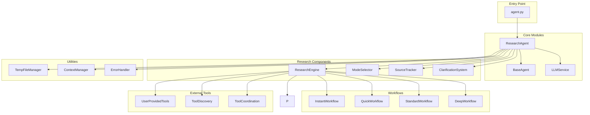

# Module Organization and Project Structure

## Overview

This document provides detailed specifications for the module organization, file structure, and component relationships in the Deep Research Agent implementation.

## Project Structure

```
research-agent/
├── docs/                                    # Documentation
│   ├── .requirement_analysis/              # Requirements documentation
│   ├── .architecture_design/               # Architecture documentation
│   └── .implementation_design/             # Implementation documentation
├── src/                                    # Source code
│   ├── base_agent/                         # BaseAgent module
│   ├── research_agent/                     # ResearchAgent module
│   ├── llm_service/                        # LLM service module
│   └── utils/                              # Shared utilities
├── tests/                                  # Test suite
│   ├── unit/                               # Unit tests
│   ├── integration/                        # Integration tests
│   └── fixtures/                           # Test fixtures
├── agent.py                                # Main entry point
├── agent.yaml                              # AgentHub configuration
├── pyproject.toml                          # Python package configuration
├── config.json                             # Runtime configuration
├── requirements.txt                        # Python dependencies
└── README.md                               # Project documentation
```

## Module Specifications

### 1. BaseAgent Module (`src/base_agent/`)

**Purpose**: Common agent capabilities shared across all agent types

**File Structure**:
```
src/base_agent/
├── __init__.py                             # Module initialization
├── core.py                                 # BaseAgent class implementation
├── context_manager.py                      # Context management
├── error_handler.py                        # Error handling and logging
└── utils.py                                # Common utilities
```

**Key Components**:

#### `core.py` - BaseAgent Class
```python
class BaseAgent(ABC):
    """Base agent class with common capabilities"""

    def __init__(self, llm_service, external_tools=None):
        # Initialization logic

    @abstractmethod
    async def solve(self, question: str) -> Dict[str, Any]:
        """Universal solve method - to be implemented by subclasses"""

    async def get_available_tools(self) -> List[str]:
        """Get list of available tools"""

    def validate_input(self, input_data: Dict[str, Any]) -> bool:
        """Common input validation"""

    async def handle_error(self, error: Exception) -> Dict[str, Any]:
        """Common error handling"""
```

#### `context_manager.py` - Context Management
```python
class ContextManager:
    """Manages agent context and state"""

    def __init__(self):
        self.context = {}
        self.session_id = None

    def set_context(self, key: str, value: Any):
        """Set context value"""

    def get_context(self, key: str = None) -> Any:
        """Get context value"""

    def clear_context(self):
        """Clear all context"""
```

#### `error_handler.py` - Error Handling
```python
class ErrorHandler:
    """Centralized error handling and logging"""

    def __init__(self):
        self.logger = logging.getLogger(__name__)

    async def handle_error(self, error: Exception, context: Dict = None) -> Dict[str, Any]:
        """Handle and log errors"""

    def log_error(self, error: Exception, context: Dict = None):
        """Log error with context"""
```

### 2. ResearchAgent Module (`src/research_agent/`)

**Purpose**: Specialized research functionality inheriting from BaseAgent

**File Structure**:
```
src/research_agent/
├── __init__.py                             # Module initialization
├── core.py                                 # ResearchAgent class
├── research_engine.py                      # Core research orchestration
├── mode_selector.py                        # Mode selection logic
├── source_tracker.py                       # URL tracking and duplicates
├── clarification_system.py                 # Deep mode clarifications
└── workflows/                              # Mode-specific workflows
    ├── __init__.py
    ├── instant.py                          # Instant research workflow
    ├── quick.py                            # Quick research workflow
    ├── standard.py                         # Standard research workflow
    └── deep.py                             # Deep research workflow
```

**Key Components**:

#### `core.py` - ResearchAgent Class
```python
class ResearchAgent(BaseAgent):
    """Research agent specialized for research tasks"""

    def __init__(self, llm_service, external_tools=None):
        super().__init__(llm_service, external_tools)
        self.research_engine = ResearchEngine()
        self.mode_selector = ModeSelector()
        self.source_tracker = SourceTracker()

    async def instant_research(self, question: str) -> Dict[str, Any]:
        """Instant research mode"""

    async def quick_research(self, question: str) -> Dict[str, Any]:
        """Quick research mode"""

    async def standard_research(self, question: str) -> Dict[str, Any]:
        """Standard research mode"""

    async def deep_research(self, question: str) -> Dict[str, Any]:
        """Deep research mode"""

    async def solve(self, question: str) -> Dict[str, Any]:
        """Auto mode selection for research"""
```

#### `research_engine.py` - Research Orchestration
```python
class ResearchEngine:
    """Core research orchestration engine"""

    def __init__(self):
        self.tool_coordinator = ToolCoordinator()
        self.data_analyzer = DataAnalyzer()
        self.gap_identifier = GapIdentifier()
        self.query_generator = QueryGenerator()

    async def execute_research(self, question: str, mode: str) -> Dict[str, Any]:
        """Execute research based on mode"""

    async def analyze_data(self, data: List[Dict]) -> Dict[str, Any]:
        """Analyze retrieved data"""

    async def identify_gaps(self, analysis: Dict, question: str) -> List[str]:
        """Identify information gaps"""
```

#### `source_tracker.py` - URL Tracking
```python
class SourceTracker:
    """Tracks scraped URLs to prevent duplicates"""

    def __init__(self):
        self.used_urls = set()
        self.url_metadata = {}

    def is_url_used(self, url: str) -> bool:
        """Check if URL has been previously scraped"""

    def mark_url_used(self, url: str, metadata: Dict = None):
        """Mark URL as used"""

    def get_unused_urls(self, urls: List[str]) -> List[str]:
        """Filter out used URLs from a list"""
```

### 3. LLM Service Module (`src/llm_service/`)

**Purpose**: Modular LLM service supporting multiple providers

**File Structure**:
```
src/llm_service/
├── __init__.py                             # Module initialization
├── core.py                                 # CoreLLMService implementation
├── providers.py                            # Provider-specific implementations
└── models.py                               # LLM model configurations
```

**Key Components**:

#### `core.py` - Core LLM Service
```python
class CoreLLMService:
    """Core LLM service with multi-provider support"""

    def __init__(self):
        self.providers = {}
        self.current_provider = None

    async def generate(self, prompt: str, **kwargs) -> str:
        """Generate text using LLM"""

    def register_provider(self, name: str, provider):
        """Register a new LLM provider"""

    def get_available_providers(self) -> List[str]:
        """Get list of available providers"""
```

### 4. External Tool Integration

**Purpose**: Integration with user-provided external tools through AgentHub

**Key Features**:
- **No built-in tools** - users provide tools via AgentHub
- **Tool discovery** from external_tools parameter
- **Tool coordination** through research engine
- **Result standardization** from various tool types

**Integration Pattern**:
```python
# Tools are provided by users through AgentHub
agent = ah.load_agent("agentplug/research-agent", external_tools=["web_search", "academic_search"])

# ResearchAgent discovers and uses these tools
class ResearchAgent(BaseAgent):
    def __init__(self, llm_service, external_tools=None):
        super().__init__(llm_service, external_tools)
        # external_tools are automatically available
```

### 4. Utils Module (`src/utils/`)

**Purpose**: Shared utilities and helper functions

**File Structure**:
```
src/utils/
├── __init__.py                             # Module initialization
├── file_manager.py                         # Temp file management
├── data_models.py                          # Pydantic data models
└── validators.py                           # Input validation utilities
```

**Key Components**:

#### `file_manager.py` - Temp File Management
```python
class TempFileManager:
    """Manages temporary files for research data"""

    def __init__(self):
        self.temp_dir = tempfile.mkdtemp(prefix="research_agent_")
        self.files = {}

    def create_temp_file(self, name: str, data: Any) -> str:
        """Create a temporary file with data"""

    def cleanup(self):
        """Clean up all temporary files"""
```

## Component Relationships

### Dependency Graph



### Import Structure

```python
# agent.py
from src.research_agent import ResearchAgent
from src.llm_service import get_shared_llm_service

# src/research_agent/core.py
from src.base_agent import BaseAgent
from .research_engine import ResearchEngine
from .mode_selector import ModeSelector
from .source_tracker import SourceTracker

# src/research_agent/research_engine.py
from src.tools.base import BaseTool
from src.utils.file_manager import TempFileManager

# src/base_agent/core.py
from .context_manager import ContextManager
from .error_handler import ErrorHandler
```

## Configuration Management

### 1. Runtime Configuration (`config.json`)
```json
{
  "llm": {
    "provider": "auto",
    "temperature": 0.1,
    "max_tokens": 4000,
    "timeout": 30
  },
  "research": {
    "max_sources_per_round": 10,
    "max_rounds": 12,
    "timeout_per_round": 300
  },
  "tools": {
    "web_search": {
      "enabled": true,
      "max_results": 10
    },
    "academic_search": {
      "enabled": true,
      "max_results": 5
    }
  }
}
```

### 2. AgentHub Configuration (`agent.yaml`)
```yaml
name: research-agent
version: 1.0.0
description: Deep research agent with multiple research modes
module: agent
class: ResearchAgent
dependencies:
  - python>=3.11
  - aiohttp>=3.8.0
  - pydantic>=2.0.0
```

## Testing Organization

### 1. Unit Tests (`tests/unit/`)
```
tests/unit/
├── test_base_agent.py
├── test_research_agent.py
├── test_llm_service.py
├── test_tools.py
└── test_utils.py
```

### 2. Integration Tests (`tests/integration/`)
```
tests/integration/
├── test_research_workflows.py
├── test_tool_integration.py
└── test_agent_integration.py
```

### 3. Test Fixtures (`tests/fixtures/`)
```
tests/fixtures/
├── sample_research_data.json
├── mock_llm_responses.json
└── test_config.json
```

## Development Workflow

### 1. Module Development Order
1. **Utils Module** - Foundation utilities
2. **BaseAgent Module** - Core agent functionality
3. **LLM Service Module** - LLM integration
4. **Tools Module** - Tool ecosystem
5. **ResearchAgent Module** - Research-specific functionality
6. **Workflows** - Mode-specific implementations
7. **Integration** - End-to-end testing

### 2. Testing Strategy
- **Unit Tests**: Test each module independently
- **Integration Tests**: Test module interactions
- **End-to-End Tests**: Test complete workflows
- **Performance Tests**: Test under load

### 3. Code Quality
- **Type Hints**: Use type hints throughout
- **Documentation**: Comprehensive docstrings
- **Error Handling**: Graceful error handling
- **Logging**: Structured logging
- **Testing**: High test coverage

This module organization provides a clear, maintainable structure for implementing the deep research agent with proper separation of concerns and extensibility.
